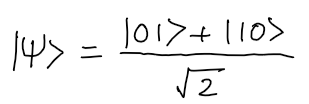
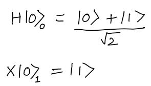

# Bell State Circuit Generator

**Submitted By:** Syed Farhan Ahmad

**Date of Submission:** 9th September, 2020

**Time of Submission:** 5:30pm IST

## Table of contents
- [Problem Statement](#problem-statement)
- [Ideal Circuit](#ideal-circuit)
- [Solution Architecture](#solution-architecture)
- [Data Encoding](#data-encoding)
- [Parameterized Circuit](#parameterized-circuit)
- [Cost Function](#cost-function)
- [Mean Squared Error](#mean-squared-error)
- [Optimizers](#optimizers)
  - [Gradient Descent](#gradient-descent)
  - [NAG(Nesterov Accelerated Gradient)](#nagnesterov-accelerated-gradient)
- [Results and Comparison](#results-and-comparison)
- [Bonus Question](#bonus-question)
- [Future Scope](#future-scope)

---
## Problem Statement ##
Implement a circuit that returns |01> and |10> with equal probability.  
**Requirements**  
- The circuit should consist only of CNOTs, RXs and RYs.   
- Start from all parameters in parametric gates being equal to 0 or randomly chosen. 
- You should find the right set of parameters using gradient descent (you can use more advanced optimization methods if you like). 
- Simulations must be done with sampling - i.e. a limited number of measurements per iteration and noise. 

- Compare the results for different numbers of measurements: 1, 10, 100, 1000. 

---
## Ideal Circuit ##
  
- The Bell State can be created by the follwing steps:  
  
- Applying `H Gate` to Qubit 0, and `X Gate` to qubit 1.  
    
- Applying CNOT gate to the combination   

The ideal circuit is as follows:

---
## Solution Architecture
- The problem statement can be solved using a Hybrid Classical-Quantum Optimization approach.  
- The Quantum Circuit is implemented using the `BellStateCircuit` class in `qpower_app.py`.
- The Loss function, optimizer function and backpropagation are implemented in `GradientDescentOptimizer` class in `qpower_app.py`.
    

---
## Data Encoding ##
1. Input data is the paramter theta, in degrees, which is the angle by which the paraterized gate will rotate.
2. The angle is converted to `radians` from `degrees`.
3. Data is mapped before execution using `parameter_binds` of the `qiskit.execute` function in `qpower_app.py`.
---
## Parameterized Circuit ##
- The parameterized circuit is created using the `qiskit.ry` gate, that takes `theta` as the input parameter. 
- Qubit 0 is initialized to statevector [1,0], and Qubit 1 to [0,1] for simplicity, and easy approach towards the said bell state.
---
## Cost Function ##
### Mean Squared Error 
- The Cost function is a simple MSE function that can easily be used with the first order derivative optimizers like Gradient Descent very easily.
- The cost function is the squared difference of the Probability averages of both states `01` and `10`, that are obtained after the circuit is executed for a given number of `shots`.

---
## Optimizers ##
### Gradient Descent
- The Gradient Descent Optimizer is being used as it simplifies the process of loss convergence when our loss function is quadratic in nature.
- The local and global minima are the same and the `loss landscape` can be easily analysed with much less compute power, and good accuracy.
- The parameter `theta` is being learned, using Gradient Descent and alpha is the `learning_rate`.  

### NAG(Nesterov Accelerated Gradient)

- Coming soon
---
## Results and Comparison ##

- The results are taken for all measurements 1, 10, 100 and 1000 respectively.
- The error of measurement is less than 1.5% in all cases as seen.
- Expected output: 90 degrees(or a multiple of 90 degrees)
---
## Bonus Question ##
How to make sure you produce state `|01> + |10>` and not `|01> - |10>` ?

- To prevent the occurrence of the state `|01> - |10>`, we will have to alter our cost function to be unsymmetrical. To alter the Mean Sqared error, we can remove the squares and keep the function linear.
- This can be done by the follwing:
  `prob_avg_10 - (prob_avg_01+prob_avg_10)/(2)`
---
## Future Scope ##
- Use of better Optimizer functions like `NAG(Nesterov Accelerated Gradient)`
- Hessian based analysis of the Loss Landscapes
